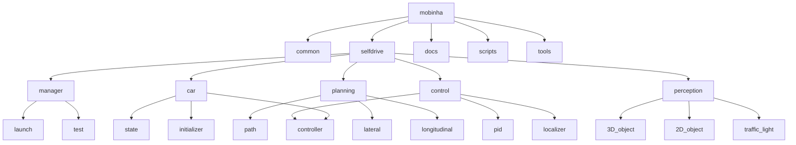

## Architecture

mobinha system architecture

```mermaid
graph TD
  mobinha --> common
  mobinha --> selfdrive
  mobinha --> docs
  mobinha --> scripts
  mobinha --> tools
  selfdrive --> manager
  selfdrive --> car 
  selfdrive --> planning
  selfdrive --> control
  selfdrive --> perception
  manager --> launch
  manager --> test
  car --> controller
  car --> state
  car --> initializer
  planning --> path
  planning --> lateral
  planning --> longitudinal
  control --> pid
  control --> controller
  control --> localizer
  perception --> 3D_object
  perception --> 2D_object
  perception --> traffic_light
```
